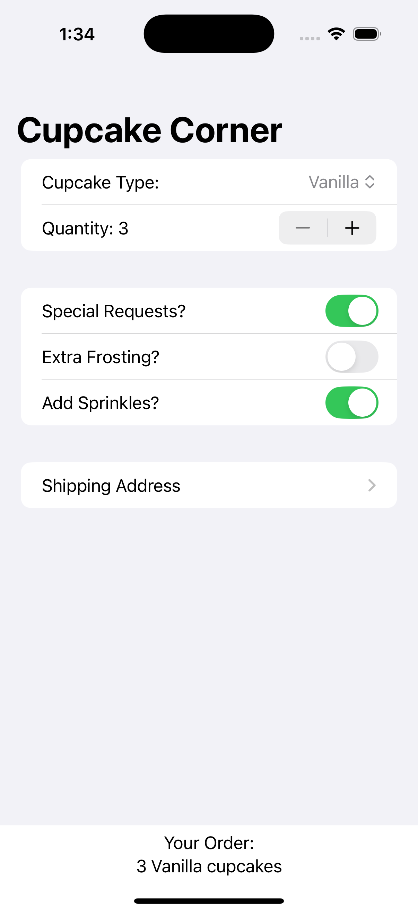
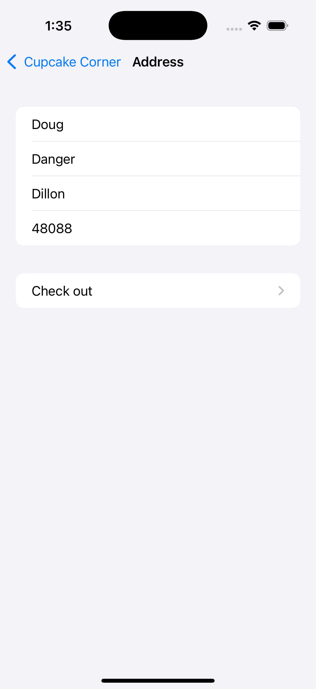
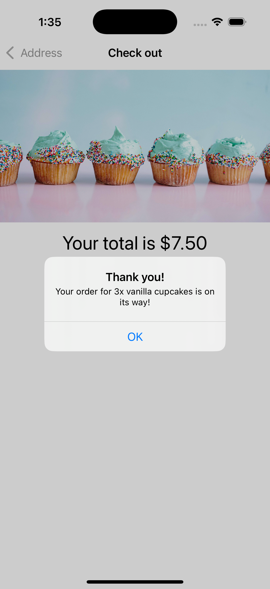

## Cupcake Corner (SwiftUI Navigation Learning Project)

A small SwiftUI app used to learn and practice basic navigation and data flow.

### Highlights

- **Navigation**: Uses `NavigationStack` with `NavigationLink` between `ContentView` → `AddressView` → `CheckoutView`.
- **Forms & Inputs**: `Picker`, `Stepper`, and `Toggle` to configure an order.
- **State sharing**: `@Observable` model (`Order`) passed via `@Bindable` to child views.
- **Validation**: Simple address validation gating checkout.
- **Networking**: Async POST of the order to a demo API (`reqres.in`).
- **Async image**: Loads a remote cupcake image with `AsyncImage` and a placeholder.

### Screenshots

  
  
  

### Run it

- **Requirements**: Xcode 15+ and iOS 17+ simulator or device.
- Open `cupcake.xcodeproj` and run the `cupcake` scheme.

### What you’ll learn

- **SwiftUI navigation** with `NavigationStack` and pushing/popping views.
- **Two-way bindings across screens** using `@Observable` and `@Bindable`.
- **Form building** with common controls inside `Form` and `Section`.
- **Async work** with `URLSession` to upload JSON and show a confirmation alert.

### Project structure

- `cupcake/cupcakeApp.swift`: App entry point.
- `cupcake/ContentView.swift`: Order configuration (type, quantity, special requests) and navigation to address.
- `AddressView.swift`: Shipping info form; enables checkout when valid.
- `CheckoutView.swift`: Shows total, loads an image, and submits the order.
- `Order.swift`: `@Observable` model, coding keys, validation, and cost computation.

### Notes

- Network calls post to `https://reqres.in` for testing only; no real orders are placed.
- Cupcake image is loaded from `https://hws.dev/img/cupcakes@3x.jpg` for demonstration.
